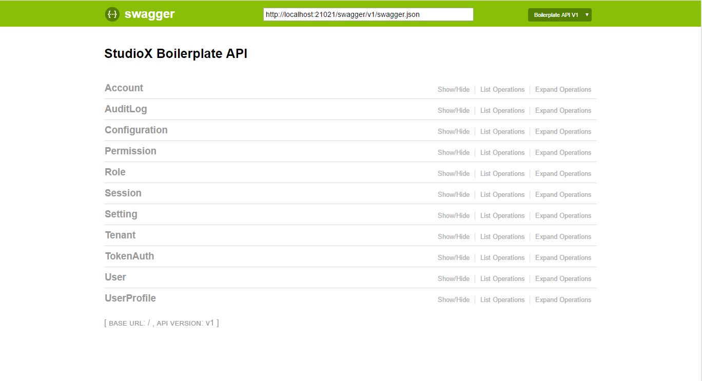
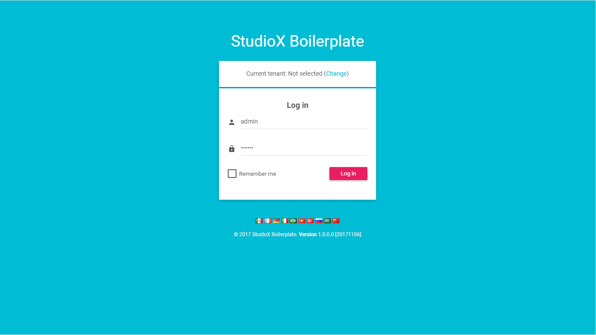
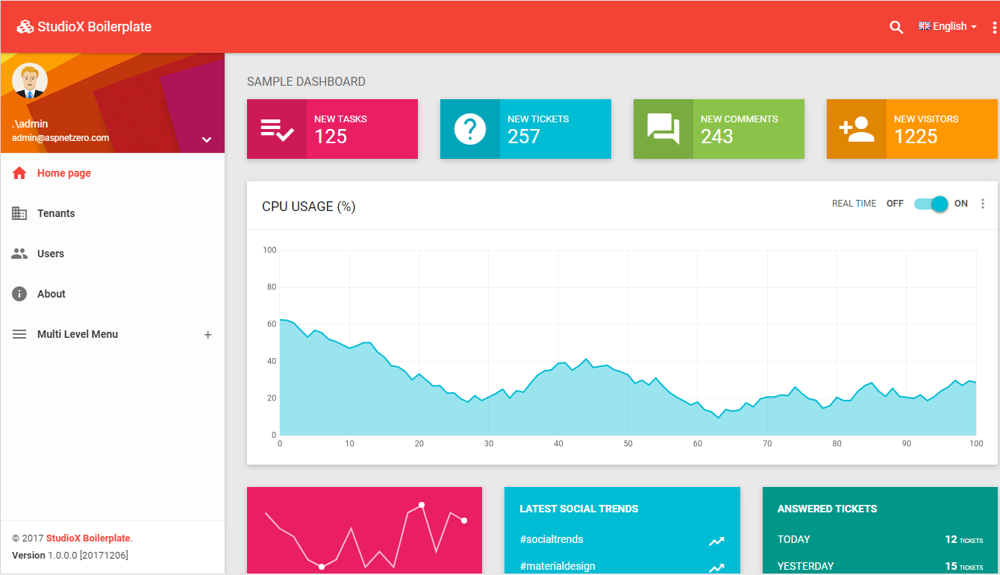

# Introduction

This is a template to create **ASP.NET Core MVC / Angular**. It has 2 different versions:

1. ASP.NET Core MVC & jQuery (server rendered multi-page application).
2. ASP.NET Core & Angular (single page application).
 
User Interface is based on [BSB Admin theme](https://github.com/gurayyarar/AdminBSBMaterialDesign).
 
# Screenshots

#### Swagger

#### Login Page

#### Sample Dashboard Page

# License

[MIT](https://opensource.org/licenses/MIT)
